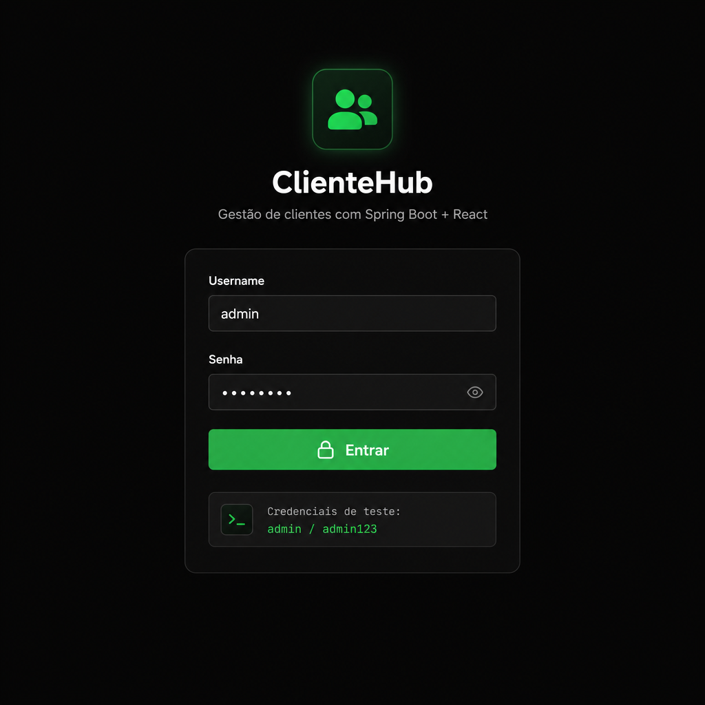
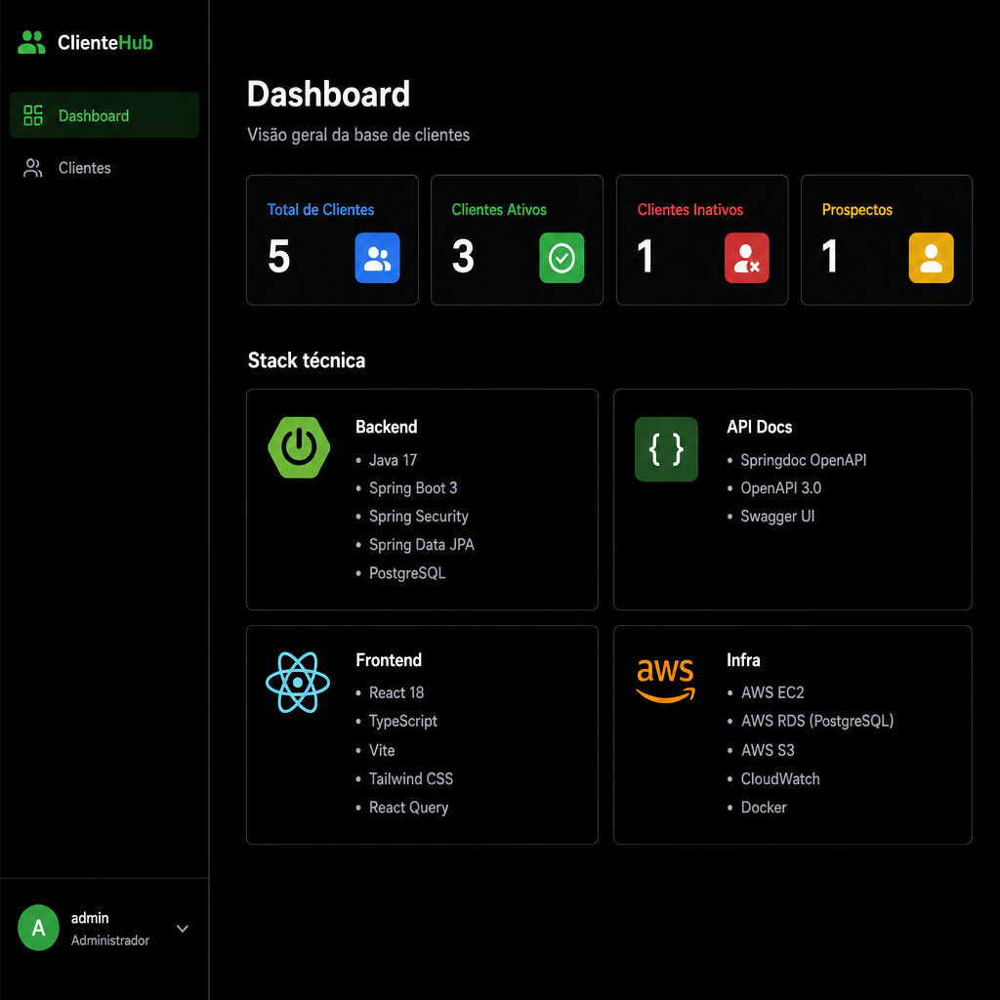
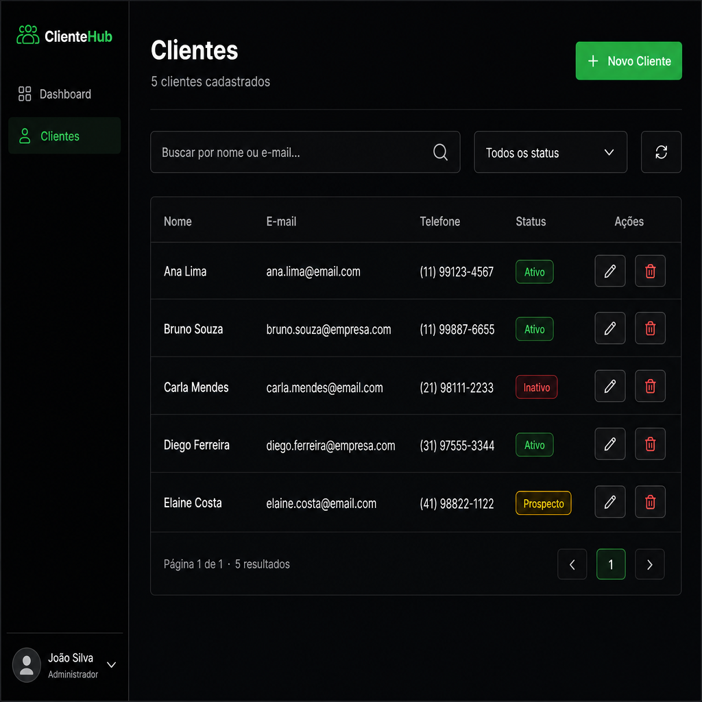

# ClienteHub

> **CRUD completo de clientes** — Spring Boot 3 REST API + React 18 Dashboard

[](https://github.com/reinaldobarreto31/clientehub/actions/workflows/ci.yml)


---

## 🚀 Live Demo

[](https://clientehub.onrender.com)

> **Credenciais padrão:** `admin` / `admin123`
>
> ⚠️ Hospedado no plano gratuito do Render — a primeira requisição pode levar ~30 s para o serviço "acordar".

| Serviço | URL |
|---|---|
| **Frontend** | <https://clientehub.onrender.com> |
| **Backend API** | <https://clientehub-api.onrender.com> |
| **Swagger UI** | <https://clientehub-api.onrender.com/swagger-ui.html> |

---

## Deploy com um clique

[](https://render.com/deploy?repo=https://github.com/reinaldobarreto31/clientehub)

O arquivo [`render.yaml`](./render.yaml) provisiona automaticamente:
- PostgreSQL 16 (free tier)
- Backend Spring Boot via Docker
- Frontend React como site estático

---

## Stack

| Camada | Tecnologias |
|---|---|
| **Backend API** | Java 21 · Spring Boot 3.3 · Spring Security · JWT |
| **Persistência** | JPA/Hibernate · PostgreSQL 16 |
| **API Docs** | OpenAPI 3 / Swagger UI |
| **Frontend** | React 18 · TypeScript · Tailwind CSS · React Query · shadcn/ui |
| **Infra** | Docker Compose · Render · GitHub Actions CI |

---

## Funcionalidades

- ✅ **CRUD completo de clientes** — nome, e-mail, telefone, status (Ativo / Inativo / Prospecto)
- ✅ **Autenticação JWT** — login/logout com token Bearer
- ✅ **Listagem paginada** com busca por nome/e-mail e filtro por status
- ✅ **Dashboard** com contadores por status
- ✅ **Modo dark/light** persistido no localStorage
- ✅ **Swagger UI** integrado em `/swagger-ui.html`
- ✅ **Dados iniciais** — usuário `admin` e 5 clientes de exemplo criados automaticamente
- ✅ **CI/CD** — GitHub Actions roda testes e build a cada push

---

## Executar localmente

### Com Docker Compose (recomendado)

```bash
git clone https://github.com/reinaldobarreto31/clientehub.git
cd clientehub
docker compose up --build
```

| Serviço | URL |
|---|---|
| Frontend | http://localhost:3000 |
| Backend API | http://localhost:8080 |
| Swagger UI | http://localhost:8080/swagger-ui.html |
| PostgreSQL | localhost:5432 |

### Sem Docker

**Backend** (requer Java 21 e PostgreSQL):

```bash
cd backend

# Configure as variáveis (ou use o application.yml)
export DATABASE_URL=jdbc:postgresql://localhost:5432/clientehub
export DATABASE_USER=postgres
export DATABASE_PASSWORD=postgres
export JWT_SECRET=your-secret-key-min-32-chars

mvn spring-boot:run
```

**Frontend** (requer Node 20+):

```bash
cd frontend
npm install
npm run dev
# Abrir http://localhost:5173
```

---

## Credenciais padrão

| Campo | Valor |
|---|---|
| Username | `admin` |
| Senha | `admin123` |

> As credenciais e 5 clientes de exemplo são criados automaticamente na primeira inicialização via `DataInitializer`.

---

## Endpoints da API

| Método | Endpoint | Descrição | Auth |
|---|---|---|---|
| `POST` | `/api/auth/login` | Obter JWT token | ❌ |
| `GET` | `/api/clientes` | Listar clientes (paginado) | ✅ |
| `GET` | `/api/clientes/{id}` | Buscar por ID | ✅ |
| `POST` | `/api/clientes` | Criar cliente | ✅ |
| `PUT` | `/api/clientes/{id}` | Atualizar cliente | ✅ |
| `DELETE` | `/api/clientes/{id}` | Remover cliente | ✅ |

Filtros disponíveis em `GET /api/clientes`:
- `search` — busca parcial em nome e e-mail
- `status` — `ATIVO`, `INATIVO` ou `PROSPECTO`
- `page` / `size` — paginação (padrão: page=0, size=10)

---

## Estrutura do projeto

```
clientehub/
├── backend/                   # Spring Boot 3 API
│   ├── src/main/java/com/clientehub/
│   │   ├── config/            # Security, OpenAPI, DataInitializer
│   │   ├── controller/        # Auth + Cliente REST controllers
│   │   ├── dto/               # Request/Response records
│   │   ├── entity/            # Cliente, Usuario (JPA)
│   │   ├── repository/        # Spring Data JPA
│   │   ├── security/          # JWT filter, service, UserDetails
│   │   └── service/           # AuthService, ClienteService
│   ├── src/main/resources/
│   │   └── application.yml
│   ├── pom.xml
│   └── Dockerfile
├── frontend/                  # React 18 + Tailwind
│   ├── src/
│   │   ├── api/               # Axios client (VITE_API_URL aware)
│   │   ├── components/        # UI + Layout + Forms + Table
│   │   ├── hooks/             # use-toast
│   │   ├── pages/             # Login, Dashboard, Clientes
│   │   └── types/             # TypeScript interfaces
│   ├── package.json
│   └── Dockerfile
├── render.yaml                # One-click Render deployment
├── docker-compose.yml
└── .github/workflows/ci.yml
```

---

## Screenshots

### Login
A tela de login com modo dark, credenciais padrão visíveis e validação de formulário.



### Dashboard
Cards com totais de clientes por status (Ativo / Inativo / Prospecto).



### Gestão de Clientes
Tabela paginada com busca, filtro por status, edição inline e exclusão.



---

## Licença

MIT © [Reinaldo Barreto](https://github.com/reinaldobarreto31)
